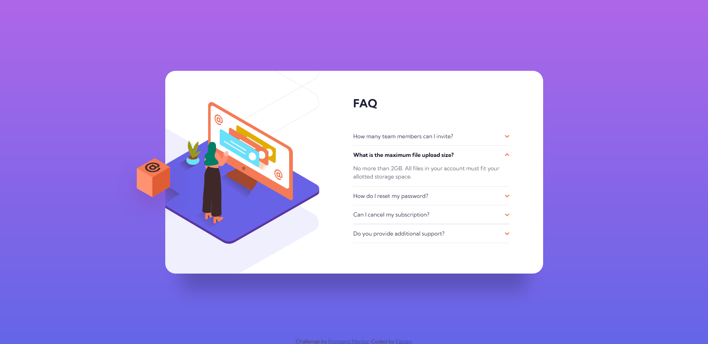

# Frontend Mentor - FAQ accordion card solution

This is a solution to the [FAQ accordion card challenge on Frontend Mentor](https://www.frontendmentor.io/challenges/faq-accordion-card-XlyjD0Oam). Frontend Mentor challenges help you improve your coding skills by building realistic projects. 

## Table of contents

- [Overview](#overview)
  - [The challenge](#the-challenge)
  - [Screenshot](#screenshot)
  - [Links](#links)
- [My process](#my-process)
  - [Built with](#built-with)
  - [What I learned](#what-i-learned)
  - [Continued development](#continued-development)
- [Author](#author)

## Overview

### The challenge

Users should be able to:

- View the optimal layout for the component depending on their device's screen size
- See hover states for all interactive elements on the page
- Hide/Show the answer to a question when the question is clicked

### Screenshot

### Links

- Solution URL: [Solution URL](https://github.com/FabianAlv/frontend-mentor-challenge-faq-accordion-card)
- Live Site URL: [Live site URL](https://fabianalv.github.io/frontend-mentor-challenge-faq-accordion-card/)

## My process

### Built with

- Semantic HTML5 markup
- Flexbox
- Mobile-first workflow

### What I learned

I learned a little about animations in CSS, I added animation to open and close the questions, I found out that for animations to work you need to add a numeric value to the property that will trigger the transition else it will not do an animation, reason is, it is really expensive and hard for the browser to do calculations of how the page will look after the transition if there is not a given value to work with.

It is good to check the style of the page in multiple browsers I say this because in this case I used the value 0.1px for the lines between the questions and although it looked fine in Chrome in Firefox it looked bad, some of the lines where missing so I decided to change it to 1px and with that all the lines showed up and it still looked good in both browsers, so I learned that it is better to use simple units without to much minor tweekings because they might behave defferent between browsers.

I learned that there is not an easy way using CSS to make an element change styles when another element is hovered over, based on some (not deep at all) [research](https://stackoverflow.com/questions/4502633/how-to-affect-other-elements-when-one-element-is-hovered/32470900#32470900) I made searching for a solution to this, at the end you need to elements to be siblings or have a relationship of parent and child to make it work easily but I didn´t like the idea of complicating my HTML for this. At the end I choosed to implement a solution with JS.

### Continued development

I want to focus more on animations and also on images, I do believe I struggled with the position of the images in the application so I want to practice that more so I have a better understanding of how to proceed when I need to position images in a certain way and how to handle the impact that will have in the rest of the content

## Author

- Frontend Mentor - [@FabianAlv](https://www.frontendmentor.io/profile/FabianAlv)
